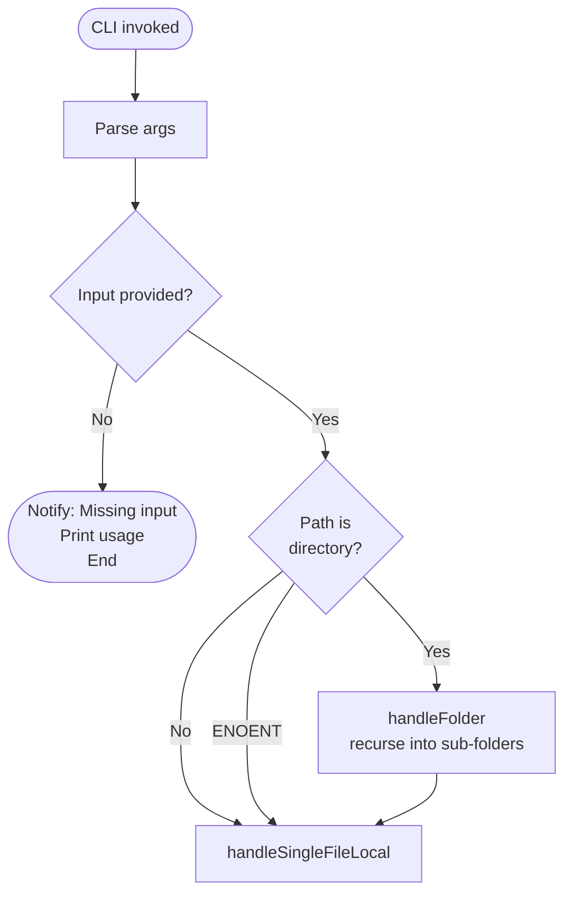
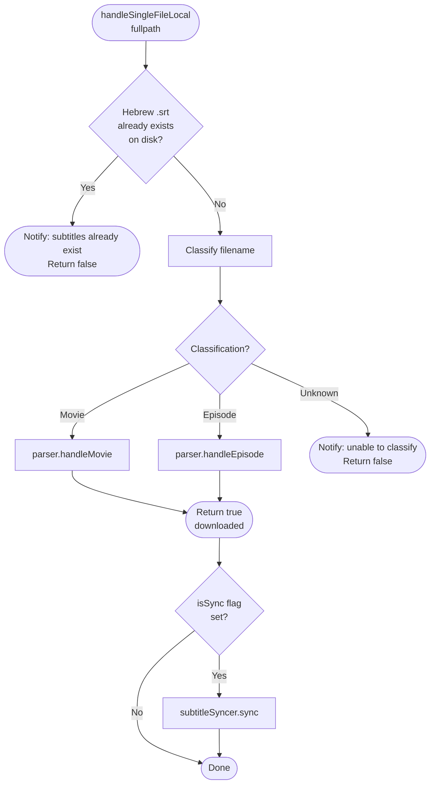
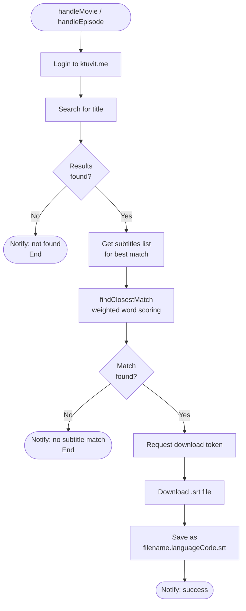
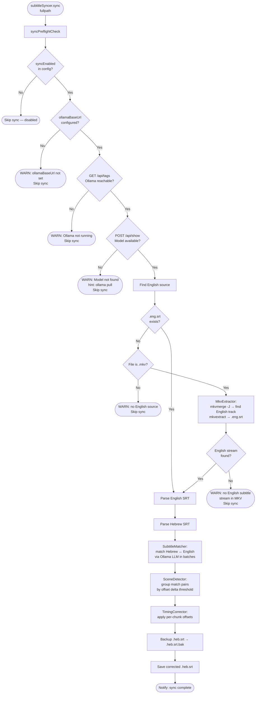
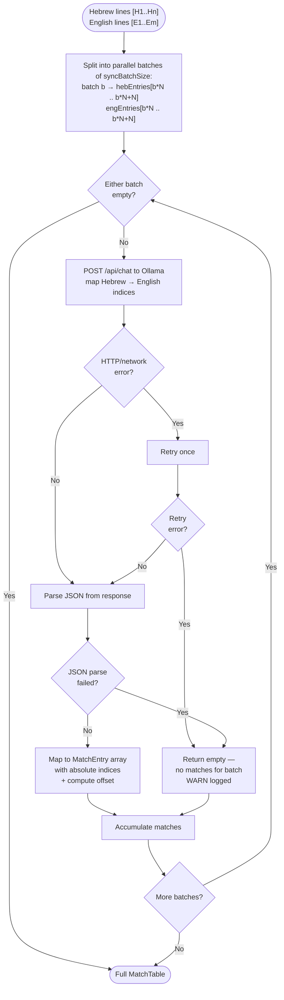
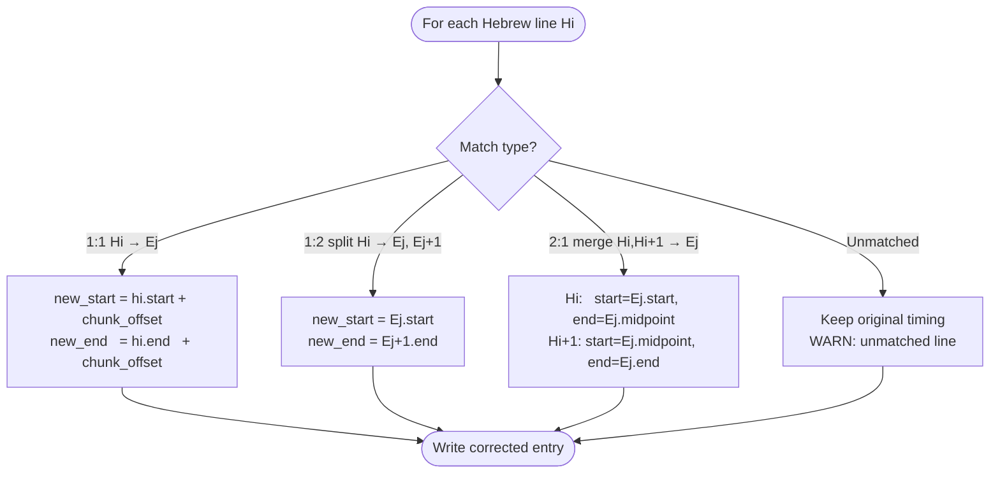

# Flow Charts

> After any code change that affects the application flow, verify these diagrams are still accurate.

---

## 1. Main Entry Flow

---

## 2. Single File Handler

---

## 3. Ktuvit Download Pipeline

---

## 4. Folder Batch Handling

---

## 5. Sync Pipeline (when `--sync` flag is set)

---

## 6. LLM Subtitle Matching (batch loop)

---

## 7. Timing Correction

