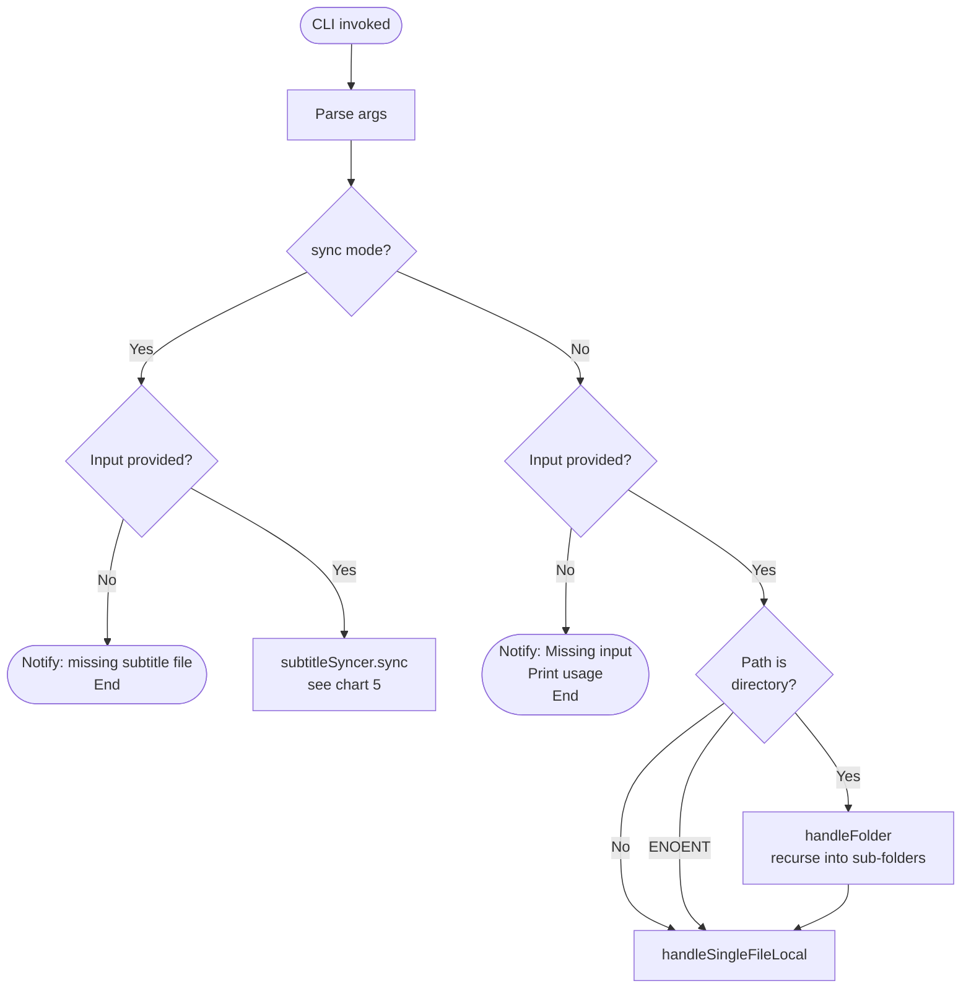
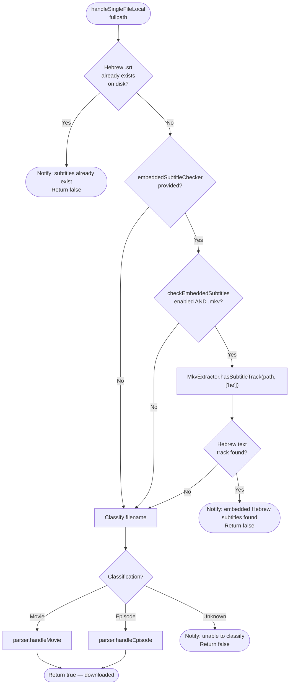
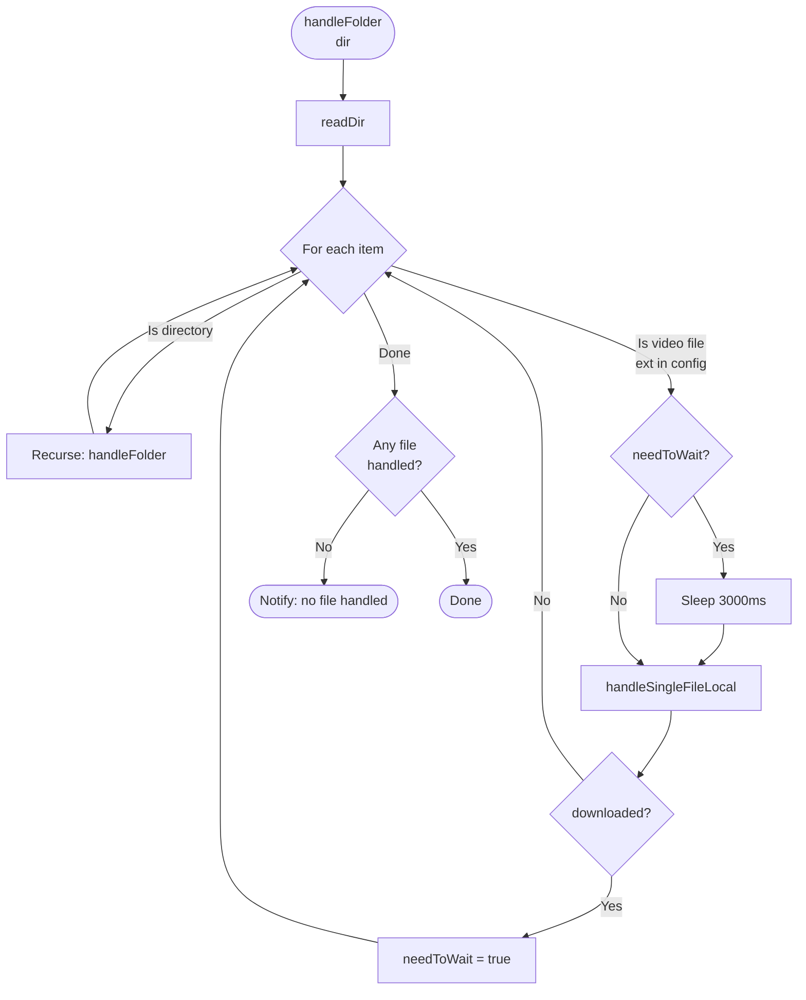
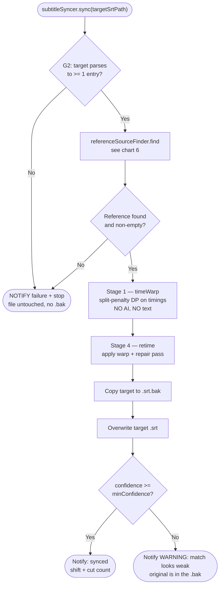
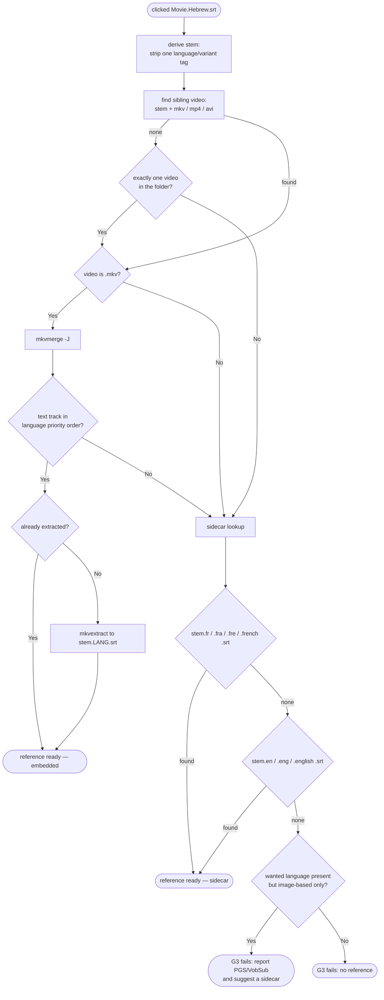
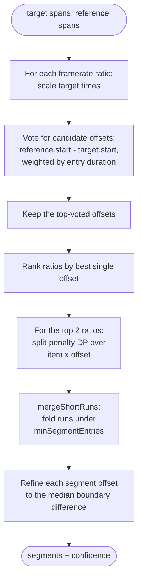
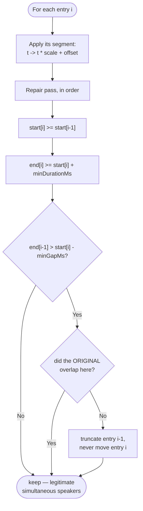

# Flow Charts

> After any code change that affects the application flow, verify these diagrams are still accurate.

The application has two **disjoint** flows, selected by what the user right-clicks. They share no
invocation and no code path.

| | Flow A — Download | Flow B — Sync |
|---|---|---|
| Right-click target | video (`.mkv` `.avi` `.mp4`) or folder | subtitle (`.srt`) |
| Menu entry | `Ktuvit-Downloader` | `Sync subtitle (Beta)` |
| CLI | `input "<path>"` | `sync input "<path.srt>"` |

---

## 1. Main Entry Flow

Sync is dispatched at the top of `main()` and returns. Nothing in the sync pipeline can affect the
download path below it.

---

## 2. Single File Handler (Flow A)

---

## 3. Ktuvit Download Pipeline

---

## 4. Folder Batch Handling (Flow A only)

Folders never trigger sync. Batch sync is deliberately not offered — a batch is mostly already in sync,
so syncing it eagerly is wasted work.

---

## 5. Sync Pipeline (Flow B)

Gates G4/G5 (Ollama reachable, embedding model pulled) arrive with Phase 3. They are **soft**: they
downgrade the bead scorer, they never stop the sync. Stages 2 and 3 — the bead DP and the segment
refit — slot between Stage 1 and Stage 4 without changing this shape.

---

## 6. Reference Source Resolution

Notes:
- **French before English.** French marks grammatical gender like Hebrew, so a French line
  disambiguates its Hebrew counterpart more often. Priority is configurable.
- **Embedded before sidecar.** An embedded track is guaranteed to be timed against *this* video file;
  a sidecar may have been downloaded for a different release.
- The reference is never allowed to resolve to the clicked file itself.
- If the `.srt` sits in a `Subs/` or `Subtitles/` folder, the parent folder is searched too.
- Sync works with no video present — only the embedded path needs one.
- **Text codecs only** (`S_TEXT/UTF8`, `S_TEXT/ASS`, `S_TEXT/SSA`). Blu-ray `S_HDMV/PGS` and DVD
  `S_VOBSUB` tracks are pictures of text and need OCR, so they are rejected. When the wanted language
  exists *only* as such a track, `findSubtitleTrack` reports it via `bitmapOnlyLanguages` and the
  failure says "image-based, add a sidecar" rather than the misleading "no reference found".
  The full subtitle-track inventory is logged at DEBUG so the log always answers why.

---

## 7. Stage 1 — timeWarp (no AI, no text)

The split penalty is what stops the fit degenerating: without a cost per split, the optimum gives every
entry its own offset, scores perfectly, and describes nothing. `mergeShortRuns` handles the related
case where one unusually long entry with no counterpart — a translator credit, a title card — can pay
for its own segment. A genuine cut shifts everything *after* it, so an island is an outlier.

---

## 8. Stage 4 — retime and repair

The repair pass is a correctness requirement, not a polish step. Real subtitles legitimately overlap
when two speakers are on screen at once — the test fixture has eight such pairs, one with two identical
spans — so the pass distinguishes an inherited overlap from one that retiming introduced, and only
repairs the latter. Text, order, and entry count are never changed.
